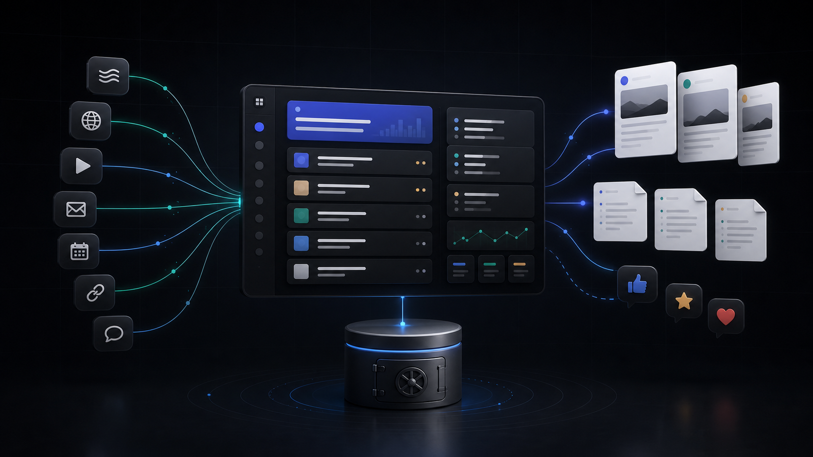
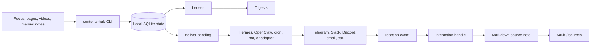

<h1 align="center">contents-hub</h1>

<p align="center">
  <strong>Save. Subscribe. Briefed by agents.</strong>
</p>

<p align="center">
  A local-first content inbox for subscriptions, digests, Markdown vaults, and chat reactions.
  <br />
  Agents run the loop. contents-hub keeps the state.
</p>

<p align="center">
  <a href="LICENSE"></a>
  
  
  
  
</p>

<p align="center">
  <a href="#reliable-first-launch-path"><strong>Quickstart</strong></a>
  ·
  <a href="install.md"><strong>Install</strong></a>
  ·
  <a href="docs/hermes-setup.md"><strong>Hermes</strong></a>
  ·
  <a href="docs/channels.md"><strong>Channels</strong></a>
</p>

<p align="center">
  
</p>

contents-hub gives coding agents and personal automation runtimes one durable
place to put the web: subscriptions, fetched items, Lens matches, digests,
outbound message mappings, reactions, and promoted Markdown source notes.

It is intentionally runtime-neutral. Hermes, OpenClaw, Claude Code, Codex,
cron, launchd, or your own loop can own the clock and the channel. contents-hub
owns the local vault, SQLite state, CLI contract, and content actions.

## What It Does

contents-hub is the missing content layer between sources, agents, schedulers,
and chat surfaces.

- Subscribe to RSS feeds, YouTube channels, webpages, and browser-backed sources.
- Route collected items through **Lenses** so digests stay topic-aware.
- Store everything locally in a vault with `.contents-hub/state.db` and
  Markdown source notes.
- Generate digest briefings from Lens-routed raw items.
- Emit channel-ready cards with `deliver pending`.
- Persist platform message ids with `delivery record`.
- Turn reactions such as `👍`, `⭐`, and `❤️` into saved Markdown source notes
  with `interaction handle`.
- Let agents install, operate, and verify the system through one repo-local skill.

## Mental Model



The runtime decides **when** to run and **where** to send messages. contents-hub
decides **what content exists**, **what has already been delivered**, and **what
a reaction should do**.

## Reliable first-launch path

Install locally from the repo:

```bash
git clone https://github.com/yansfil/contents-hub
cd contents-hub
uv sync
uv run contents-hub --help
```

Create a vault and run the smallest useful loop:

```bash
uv run contents-hub init ~/contents-vault
uv run contents-hub --vault ~/contents-vault raw add "A pasted note" --title "Manual note"
uv run contents-hub --vault ~/contents-vault digest
uv run contents-hub --vault ~/contents-vault web --port 8585
```

Open `http://localhost:8585` for the local dashboard.

For RSS, create a Lens first, then add a feed:

```bash
uv run contents-hub --vault ~/contents-vault lens create ai --name "AI" --keyword ai
uv run contents-hub --vault ~/contents-vault sub add <rss-feed-url> --type rss.feed --title "Example"
uv run contents-hub --vault ~/contents-vault fetch-all
uv run contents-hub --vault ~/contents-vault digest
```

For a durable shell command outside the repo:

```bash
uv tool install -e .
contents-hub --vault ~/contents-vault sub list
```

## Agent-First Install

The recommended path is to install the single `contents-hub` skill in your
agent runtime, then ask the agent to install the CLI, initialize or reuse a
vault, add subscriptions, schedule fetches, and verify the flow.

Hermes:

```bash
hermes skills install skills-sh/yansfil/contents-hub/skills/contents-hub --yes
```

OpenClaw:

```bash
git clone https://github.com/yansfil/contents-hub
cd contents-hub
openclaw skills install ./skills/contents-hub --as contents-hub --global
```

The skill is intentionally CLI-first. Agents should use commands such as
`contents-hub sub add`, `fetch-all`, `digest`, `deliver pending`,
`delivery record`, and `interaction handle` instead of inventing runtime-specific
state.

See [install.md](install.md) for the full skill-first setup contract and smoke
tests.

## Channel Reactions

contents-hub does not need to own your Telegram, Slack, or Discord bot. It only
needs a channel adapter to preserve message ids.

```bash
contents-hub --vault ~/contents-vault deliver pending --format json

# send the card with your runtime adapter, then record the platform message id
contents-hub --vault ~/contents-vault delivery record \
  --platform telegram \
  --channel-id <chat_id> \
  --message-id <message_id> \
  --payload-type raw_item \
  --raw-item-id <raw_item_id>

# later, forward the normalized reaction event
contents-hub --vault ~/contents-vault interaction handle \
  --event-json '{"platform":"telegram","channel_id":"<chat_id>","message_id":"<message_id>","kind":"reaction","value":"👍"}'
```

Default reactions:

| Reaction | Action |
| --- | --- |
| `👍`, `⭐`, `❤️`, `❤` | Save and promote the raw item into `sources/*.md` |
| `✅` | Mark read |
| `🗑` | Archive |

This is the contract Hermes, OpenClaw, Slack, Discord, Telegram, or any custom
adapter can implement.

## Runtime Integrations

| Runtime | Status | Notes |
| --- | --- | --- |
| Plain shell / cron / launchd | Ready | Run CLI commands on your own schedule. |
| Hermes | Documented | Profile-aware setup, cron topology, and Telegram-style adapter flow. |
| OpenClaw | Documented | Skill install and task/gateway setup runbook. |
| Codex / Claude Code loops | Compatible | Use the CLI and skill; let the runtime own scheduling. |
| Slack / Discord packaged bots | TODO | Channel contract is ready; packaged adapters are a follow-up. |

Runtime docs:

- [Hermes Setup](docs/hermes-setup.md)
- [OpenClaw Setup](docs/openclaw-setup.md)
- [Schedulers](docs/schedulers.md)
- [Channels](docs/channels.md)
- [Runtime Matrix](docs/runtime-matrix.md)

## Core Concepts

| Concept | Meaning |
| --- | --- |
| Vault | Local directory containing `.contents-hub/`, `sources/`, and generated notes. |
| Subscription | A source definition: RSS feed, YouTube channel, webpage, browser source, etc. |
| Raw item | One collected item in SQLite before promotion. |
| Lens | A topic/routing rule that decides what belongs in a digest or inbox. |
| Digest | A briefing generated from Lens-routed raw items. |
| Delivery mapping | Platform message id recorded for later reaction handling. |
| Interaction | A normalized channel event such as a reaction. |
| Source note | Immutable Markdown document under `sources/`. |

## CLI Cheatsheet

```text
contents-hub init
contents-hub sub add|remove|list
contents-hub raw add
contents-hub fetch
contents-hub fetch-all
contents-hub tick
contents-hub daemon run|loop|install|uninstall|status
contents-hub digest
contents-hub lens create|list|update|delete
contents-hub explore
contents-hub exploration add|list|run|run-all|delete
contents-hub browser open|status|kill
contents-hub deliver pending
contents-hub delivery record|list
contents-hub interaction handle|rules list
contents-hub web
```

## Browser Profile

For login-required sources, open the dedicated `contents-hub` Chrome profile and
sign in manually:

```bash
contents-hub --vault ~/contents-vault browser open
contents-hub --vault ~/contents-vault browser status
```

The profile is fixed to `contents-hub`. contents-hub does not store passwords or
site tokens.

## Maturity

Reliable today:

- Manual notes and read-later URLs
- RSS feeds with user-created Lenses
- YouTube/page metadata collection where available
- SQLite-backed digests and dashboard
- Delivery mappings and normalized reaction handling
- Markdown source promotion
- Hermes/OpenClaw setup documentation

Experimental or adapter-dependent:

- Login-required browser-backed social sources
- Exploration recipes
- Packaged Slack/Discord/Telegram bot adapters
- MCP bridge and additional agent runners

## Documentation

- [Quickstart](docs/quickstart.md)
- [Install](install.md)
- [Architecture](docs/architecture.md)
- [Initialization](docs/initialization.md)
- [Runtime Matrix](docs/runtime-matrix.md)
- [Hermes Setup](docs/hermes-setup.md)
- [OpenClaw Setup](docs/openclaw-setup.md)
- [Schedulers](docs/schedulers.md)
- [Channels](docs/channels.md)
- [Launch Checklist](docs/launch.md)
- [Skill](skills/contents-hub/SKILL.md)

## License

MIT
